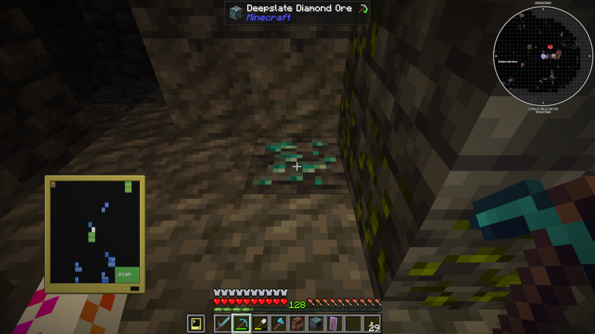

# CC-handheldGeoscanner
Computercraft-Tweaked GUI program to scan for ores using an `Advanced Geo Pocket Computer` and a `Player Detector`
It displays the ores (with height indication) on the display using the Player Detector as a self-orientation method.
Allows for custom allow-listing of ores.



## Setup
To install CC-handheldGeoscanner, enter this command in the pocket computer CLI or download the `handheldGeoscanner.lua` file from the list above:
```
wget https://raw.githubusercontent.com/LD-Reborn/CC-GUI/refs/heads/main/GUI.lua
```

## Usage
1. Craft an `Advanced Geo Pocket Computer` (using an `Advanced Pocket Computer` and a `Geo Scanner`)
2. Craft a `Player Detector` and keep it in your inventory
3. Run `handheldGeoscanner` in the pocket computer CLI
4. Press the "scan" button. Once it turns green, it's running.

## FAQ
### How to change the ores / show other blocks?
1. Open your pocket computer and enter this command: `edit config.json`
2. you will find:
```json
{
    "oresAllowList": {
        "minecraft:ancient_debris": "black",
        //...
    }
}
```
3. Find out the name of the ore you want to find. It's in the format of `mod:block_name`. E.g. `minecraft:iron_ore`, `ae2:quartz_cluster`. You can find it by looking at the block, pressing F3 and looking on the right side below "Targeted Block:". You can also enter a part of the name. E.g. "iron_ore" to also automatically include deepslate variants.
4. Add your block to the top of the list. e.g. `"minecraft:redstone_ore": "red"`. You can find the list of valid colors [here](https://tweaked.cc/module/colors.html).
### The monitor bobs up and down in my hand all the time
If you have a `Player Detector` in your inventory, the pocket computer switches between it and the `Geo Scanner`. The game interprets this as if you are now holding a new item in your hand, triggering the fade-out and fade-in animations.

If you know a better solution, feel free to reach out or create a pull request.